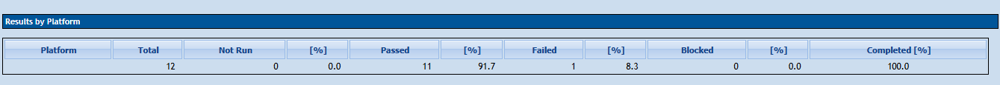

# 📊 Relatório de Execução de Testes - SauceDemo

**Projeto:** SauceDemo E-Commerce  
**Ferramenta de Gestão:** TestLink  
**Versão do Sistema (Build):** v1.0.0  
**Data da Execução:** 22/07/2026  
**Responsável QA:** Otavio Alves  

---

## 📈 Resumo Executivo & Métricas

Abaixo está o resultado da execução da suíte de testes manuais planejada para o fluxo principal da aplicação.

| Métricas | Quantidade | Porcentagem |
| :--- | :---: | :---: |
| **Total de Casos de Teste** | 12 | 100% |
| 🟢 **Aprovados (Passed)** | 11 | 91.7% |
| 🔴 **Reprovados (Failed)** | 1 | 8.3% |
| 🟡 **Bloqueados (Blocked)** | 0 | 0.0% |

### 📸 Dashboard de Métricas (Gerado no TestLink)

---
## 🐞 Defeitos Encontrados

Durante a execução da suíte, foi identificado **1 bug (reprovado)** no fluxo de checkout.

👉 Para conferir o detalhamento completo, evidências em vídeo e passos para reproduzir, acesse o documento [04-relatorios-de-bugs.md](04-relatorios-de-bugs.md).

---

## 📁 Arquivos de Suporte do TestLink

Para fins de auditoria ou reutilização em outras instâncias do TestLink, os arquivos originais estão armazenados neste repositório:

* ⚙️ [Arquivo de Importação em XML (Suíte de Testes)](evidencias/saucedemo_testlink.xml)
* 📄 [Relatório em PDF (Backup Gerado pelo TestLink)](evidencias/Relatorio_de_Execucao.pdf)